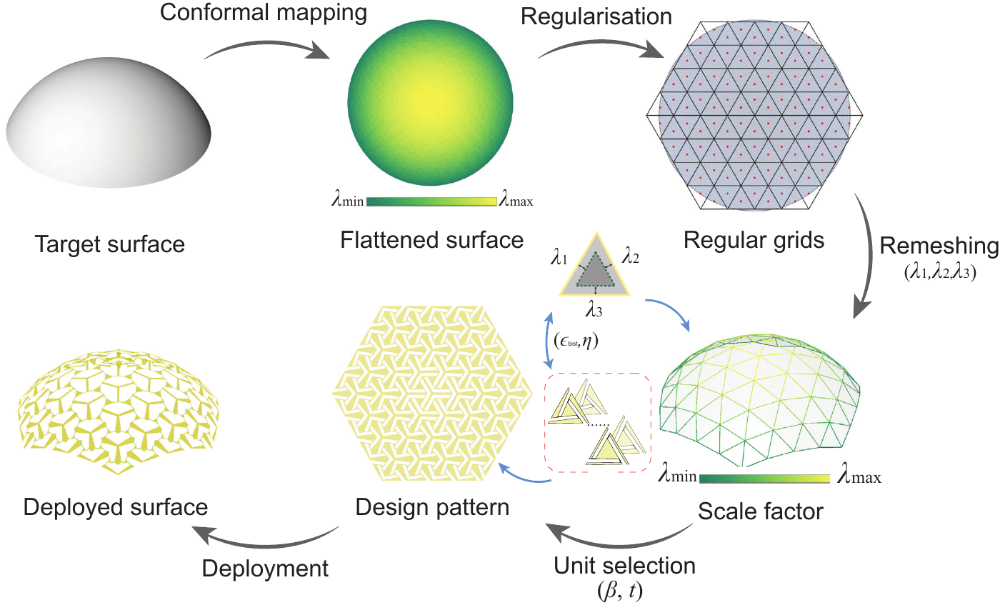

# Bistable conformal kirigami

**From a curved target surface to a flat kirigami pattern, with mechanics guiding the unit design.**

Research code for [*Instability-induced bistable shape-morphing kirigami structures*](https://arxiv.org/abs/2607.26941), Xiaoyuan Ying and Marcelo A. Dias. **Preprint, 2026 — under review.**



A conformal map describes the local expansion needed to cover a curved surface. A regular triangular grid turns that smooth description into three edge stretches per unit. A mechanical library then guides the choice of unit tilt and ligament width. Unit energy curves help assess whether a second stable configuration exists.

## Three entry points

Open the repository folder in MATLAB and run `setup_project` first.

| Program | What it does | Main output |
|---|---|---|
| `main_surface` | Target mesh + supplied UV map → grid → unit assignment → cut pattern | Geometry, assignment CSV, SVG and overview |
| `main_unit_energy` | Deploy a unit along prescribed edge stretches and detect bistability | Energy curves, classification and solver diagnostics |
| `main_unit_library` | Sweep triangle angles and unit tilt; optionally clean and refine the library | Raw batches, processing reports and a new lookup table |

```matlab
setup_project
surface = main_surface;      % start here: quarter-dome example
energy = main_unit_energy;   % two illustrative unit responses
```

Settings live in `config/`. To try another supplied target:

```matlab
root = setup_project;
cfg = surface_config;
cfg.mesh = fullfile(root, 'data', 'meshes', 'double_dome', 'double_dome_flat.obj');
surface = main_surface(cfg);
```

Each run gets its own folder in `results/`, with the configuration saved alongside its output. The full library sweep is expensive; use the small example in [the workflow guide](docs/workflow.md#3-build-a-unit-library) first.

## Requirements and scope

Checked with **MATLAB R2025a and Optimization Toolbox**. Parallel Computing Toolbox is needed when parallel execution is enabled. The supplied meshes already contain UV maps; generating a new conformal map requires a separate tool such as Boundary First Flattening. COMSOL is not required or bundled.

This is a maintained research-code project, not an exact reproduction archive for every paper figure. The default surface run completes, but **12 of 37 interior units miss the configured strain tolerance** and the reparameterisation returns its barycentric fallback. The output records both. Unit-library assignment and independent-unit energy sums do not establish the bistability of an assembled sheet.

[Workflow and settings](docs/workflow.md) · [What was checked](docs/validation.md) · [Changes](CHANGELOG.md)

## Where things belong

| Location | Contents |
|---|---|
| `main_*.m` | The three programs above |
| `config/` | Mesh choices, geometry and sweep settings |
| `src/surface/` | Mesh alignment, regular-grid fitting and reparameterisation |
| `src/geometry/` | Unit coordinates and compact/deployed tessellations |
| `src/design/` | Stretch descriptors and unit-library assignment |
| `src/mechanics/` | Hencky bar-chain energy model and bistability detection |
| `src/library/` | Library cleanup, interpolation and endpoint refinement |
| `src/export/`, `src/plotting/` | SVG export and result plots |
| `data/` | Three target/UV meshes and the selected unit library |
| `tests/`, `docs/` | Checks, instructions and provenance |
| `results/` | Generated runs, ignored by Git |

Unused drivers, duplicate demos, experiment-comparison scripts and saved COMSOL models have been removed from the current tree. Earlier versions remain in Git history. The author's original research directory is unchanged.

## Check, cite and reuse

```matlab
setup_project
checks = runtests('tests');
assertSuccess(checks)
```

Use [`CITATION.cff`](CITATION.cff) to cite the preprint. A project-wide software licence has not yet been selected; see [rights and attribution](RIGHTS.md). The OBJ reader retains its original BSD-3-Clause licence. Configure one paper repository at a time: the 2D and 3D projects share some function names.
