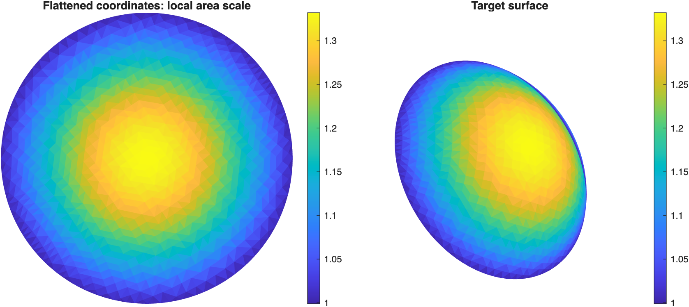

# Bistable conformal kirigami

**Design a flat cut sheet that reaches a curved shape — and can retain a deployed state.**

Research code for [*Instability-induced bistable shape-morphing kirigami structures*](https://arxiv.org/abs/2607.26941), Xiaoyuan Ying and Marcelo A. Dias (2026). **Preprint; under review.**


## The idea

Conformal mapping gives a smooth starting description of how a flat domain must expand to cover a surface. A discrete triangular grid turns this into local edge-stretch requirements. Kirigami units are then selected using their geometry and mechanical response, including the energy barrier between stable configurations.

Matching local area alone is insufficient: discrete units can experience different stretches along their three edges, and this anisotropy affects bistability.


[Visual paper guide](docs/paper-guide.md) · [Requirements and reproducibility](docs/reproducibility.md) · [Validation record](docs/validation.md)

## Start here

Clone this repository, open its root folder in MATLAB and run:

```matlab
setup_project
mesh = demo_conformal_mesh('quarter_dome'); % inspect the supplied UV map
energy = demo_unit_energy;                  % requires Optimization Toolbox
```

The first example reads an existing BFF-flattened mesh and displays its local area scale. The second evaluates an illustrative unit's energy during isotropic deployment using the existing Hencky bar-chain model. Each writes data and a figure to a new folder in `results/`.



The UV map is supplied data; the example does not run Boundary First Flattening. These examples introduce separate parts of the method. They do not establish that every generated surface is bistable or reproduce the full experiment.

## Repository layout

| Folder | Purpose |
|---|---|
| `examples/` | Small entry points with explicit inputs and saved outputs |
| `src/conformal/` | Surface mapping, reparameterisation, edge stretches, HBM and export |
| `src/units/` | Triangular/hexagonal kirigami geometry |
| `src/inverse_design/` | Unit-library generation, assignment and bistability analysis |
| `src/conformal_2d/` | Planar mapping and initial tessellation assembly |
| `data/meshes/` | Selected target meshes and supplied UV maps |
| `data/unit-library/` | The lookup table used by the original 3D driver |
| `models/comsol/` | Optional finite-element models and comparison scripts |
| `legacy/` | Full research drivers and experiment-analysis scripts |
| `third_party/` | OBJ reader with its original licence |
| `docs/` | Explanation, provenance and validation |
| `tests/` | Geometry and supplied-data checks |
| `results/` | Generated output, ignored by Git |

Use this repository separately from the 2D paper project: the codebases contain some identical function names. `setup_project` adds only this project's source and examples; it does not alter the saved MATLAB path.

## Full surface workflow

The original `main_3D.m` driver is retained under `legacy/`, with repository-relative input paths. It covers regular-grid fitting, reparameterisation, unit selection and tessellation. Read [the workflow notes](docs/reproducibility.md#full-surface-workflow) before adapting it. A selected beta or a generated pattern alone is not a validated bistable structure; inspect interpolation flags, strain mismatch and mechanical results.

This is a maintained research-code snapshot, not a frozen reproduction package for every paper figure. Numerical model constants are preserved; the cleanup makes organisation and entry points clearer. The publication status remains **under review**.

## Check, cite and reuse

```matlab
setup_project
results = runtests('tests');
assertSuccess(results)
```

Use [`CITATION.cff`](CITATION.cff) to cite the preprint. There is no project-wide software licence yet; see [rights and attribution](RIGHTS.md). The bundled OBJ reader retains its BSD-3-Clause licence.
