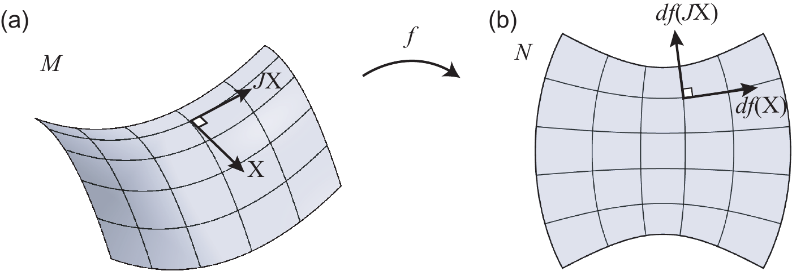
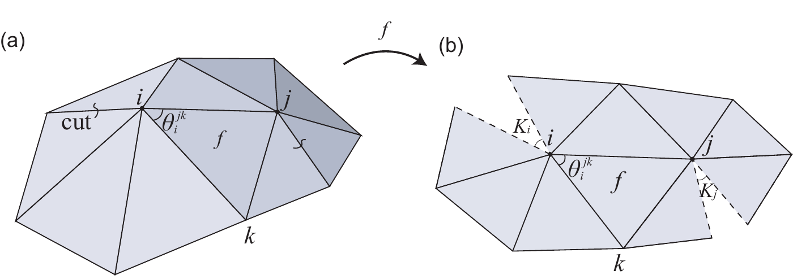
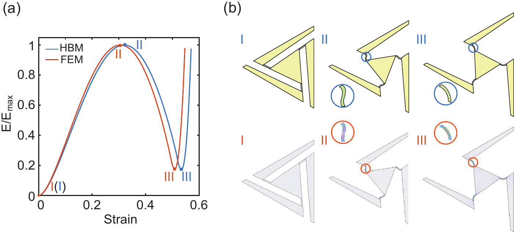

# A quick guide to the paper

## 1. Smooth setting: start from a surface

A conformal map locally preserves angles while allowing scale to vary. This gives a smooth geometric description of the expansion needed to transform a planar domain toward a curved surface. The supplied `*_flat.obj` files store both target vertices and planar texture coordinates.

**Try:** `demo_conformal_mesh`. It plots the area-derived scale `sqrt(A_surface / A_flat)` on corresponding triangles. This scalar is a useful introduction, not the complete discrete design criterion.

## 2. Discrete setting: ask what each unit must do

A regular triangular grid is fitted to the domain and transferred to the surface. Reparameterisation reduces undesirable distortion. Each triangle has three edge-stretch demands, which need not be equal. The code converts them into the variables used to select a kirigami unit from a precomputed mechanical library.

**Follow:** `generate_overlay_grid` → `fit_grid` → `reparameterization` → `calculate_scale_facs` → `scale_facs_to_angles` → `assign_opt_beta`.

The lookup table is sampled numerical data. An assignment can fail, fall back, or retain a nonzero strain mismatch. The `info` output of `assign_opt_beta` is part of the result, not optional bookkeeping.

## 3. Bistability: shape the energy landscape

Ligament geometry changes how bending and stretching store energy during deployment. An intervening energy barrier can separate a compact state from a second stable configuration. Anisotropic deployment changes this response, so the mechanical assessment must accompany the geometric design.

The Hencky bar-chain model represents ligament bending and extension with a discrete chain. `deform_triangle_isotropic` evaluates isotropic paths; `deform_triangle_anisotropic` and `bistability_analysis` address directional deformation and identify an energy peak followed by a meaningful local minimum.

**Try:** `demo_unit_energy`. It produces a new illustrative energy sweep using the inherited model. Its settings and normalized display are not a claim to reproduce the paper's calibration or finite-element curves.

## 4. Assess the assembled structure

The research combines geometry, reduced mechanical modelling, finite-element comparisons and experiments. The reduced inverse-design procedure has limits, including its treatment of out-of-plane behaviour. A successful geometry export alone is insufficient evidence of shape accuracy or bistability.

All figures on this page are authors' research figures from the [preprint and supplement](https://arxiv.org/abs/2607.26941); [provenance](figures/README.md). The manuscript is **under review**.
