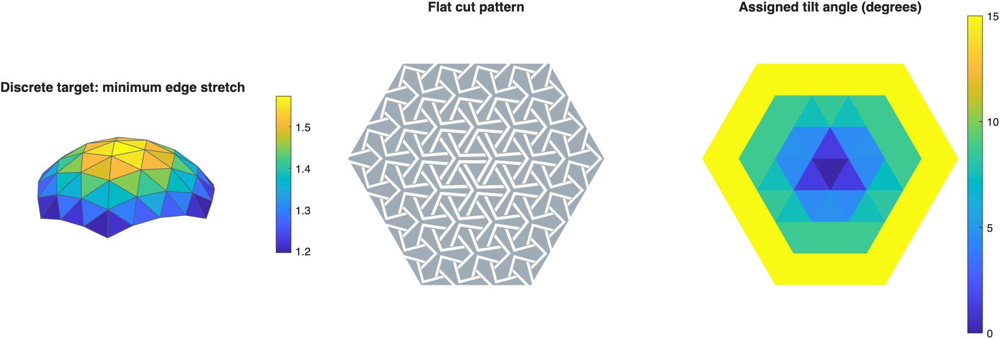
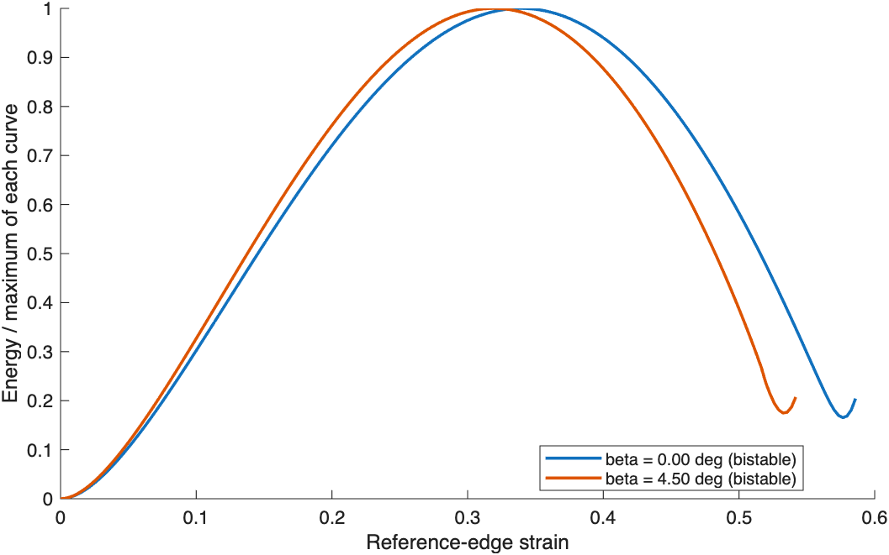

# Validation record — 8 October 2026

Checked locally with MATLAB R2025a (25.1) and Optimization Toolbox. Parallel Computing Toolbox was installed; the checks used serial execution. Runs started with the default MATLAB path plus this repository, so the original research folders could not supply missing functions.

## Automated checks

**10 passed, 0 failed, 0 incomplete** (about 12 seconds):

- Triangle-area scaling and uniform edge-stretch scaling.
- Finite, nondegenerate UV/3D connectivity for all three supplied meshes.
- Required unit-library columns and angle sums.
- Correct target-triangle edge ordering; rejection of impossible edge lengths.
- Explicit rim handling and preservation of out-of-range assignment residuals.
- Preservation of edge-stretch ratios under uniform target rescaling.
- The anisotropic three-ligament model agrees with its isotropic reduction to within `1e-5` of the peak energy, over 41 points through strain 0.55 at beta = pi/40. All reduced-model solver checks pass.
- An invalid unit makes the total energy unavailable rather than silently being omitted.

MATLAB's dependency analysis resolves **49 project files** from the three entry points, including all **41 retained source functions**. No source dependency resolves to another research folder. The three OBJ inputs and selected MAT library are byte-for-byte identical to source commit `d978245`.

## Surface workflow

`main_surface` was run with `surface_config` defaults, including deployed geometry, plotting and filleted SVG export.

| Check | Observed result |
|---|---|
| Quarter-dome target | 997 target vertices, 1,812 faces |
| Fitted grid | 73 triangular units |
| Boundary prescription | 36 rim units at beta = pi/12 |
| Interior assignment tolerance | 25 of 37 within strain mismatch 0.015; 12 require review |
| Reparameterisation | Line search stopped at iteration 1; barycentric fallback used |
| Deployed-unit geometry | All exit flags positive (1 or 2) |
| Largest geometry constraint residual | `7.55e-15` |
| Output | MAT, assignment CSV, nonempty SVG and PNG written |

This verifies that the retained pipeline executes and exposes its limitations. It does **not** establish that the candidate pattern is an optimised or experimentally validated bistable sheet. The 12 unmatched interior units and the fallback are retained and reported, rather than hidden by changing the tolerance or example.

## Unit mechanics

`main_unit_energy` was run with its default geometry and target edge stretches `[1.63 1.63 1.63]`.

| Beta | Evaluated steps | Detector result | Detected strain | Eta | Largest constraint residual |
|---|---:|---|---:|---:|---:|
| 0 | 187 | Bistable on the sampled path | 0.5733 | 0.829953 | `5.44e-15` |
| pi/40 | 173 | Bistable on the sampled path | 0.5292 | 0.818687 | `3.11e-15` |

All energy-solver exit flags were positive. CSVs, the MAT result and the plotted curves were inspected. The curves stop after the detector confirms the second minimum.

Before objective conditioning was added, the beta = 0 run failed at step 2 with exit flag 0 and residual 0.0472. The current solver rescales only its objective and gradient by a positive stiffness constant, returning energy in the original model's units. The isotropic-limit comparison above checks this change independently; it is not a material calibration or a proof of global optimality.

## Library workflow

- A raw single-case sweep completed with equilateral target angles, beta = pi/40, scale = 1.63 and the default sweep flank-length ratio 0.80. Raw detected strain was 0.3843 and eta was approximately 0.60897.
- The final `main_unit_library` ran the same case with postprocessing and endpoint refinement enabled. It wrote settings, the raw batch with detector diagnostics, processed tables and the final library. The refinement reported `alpha_nan_endpoint_used`, with eta approximately 0.60918. This is an endpoint estimate, **not** a newly detected interior minimum.
- Cleanup/filling functions were also exercised on the already-processed 1,590-row supplied table; 1,590 finite rows remained. This checks execution on that input, not the scientific correctness of every interpolation.
- One finite row of the supplied table was rerun through endpoint refinement using its saved geometry. The outcome was again `alpha_nan_endpoint_used`, recorded rather than relabelled as convergence.

## Not established by these checks

The full dense library sweep, full-sheet energy sum, parallel execution, other target surfaces beyond input-geometry checks, experimental agreement, and reproduction of every manuscript figure were not run. New geometries and material/length conventions require their own validation. The manuscript remains **under review**.

## Public-release check — 9 October 2026

All 10 fast MATLAB tests passed again with the default MATLAB path plus this project. Dependency analysis from the three main entry points reached all 41 retained source functions, with no dependency on the other research directories. Documentation links and the tracked-file list were checked. This release check did not repeat the full COMSOL optimisation or the dense unit-library sweep; the numerical runs and limitations above still apply.
